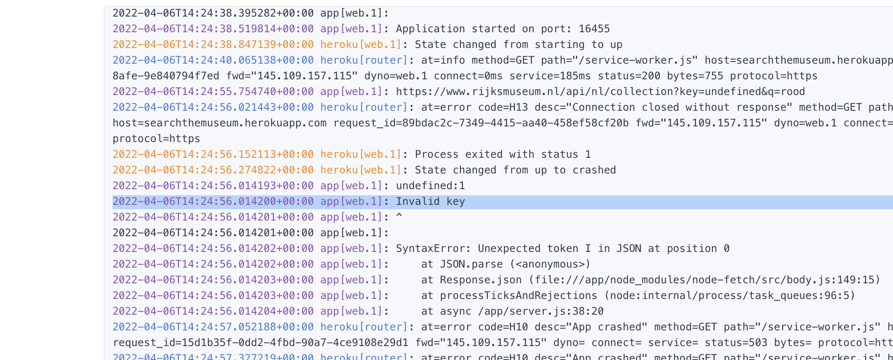

# Heroku troubleshooting

This file contains a list of common errors or crashes when uploading your website to Heroku. You should consult this file every time your logs on Heroku display some form of `changed status from started to crashed` or similar.
Please do note, it is still your task to troubleshoot and solve your error. If the error you've encountered is not included in the list, please let us know in the Teams channel so we can add it. Do not forget to take a screenshot beforehand.

## Missing .env or "config vars" (_cannot read property x of y_)

This error usually states something like _undefined_ or _invalid key_ or _unable to connect to Heroku_. This happens because Heroku has their own way of entering the environment variables. In Heroku, go to settings and scroll down until you see the button "Reveal Config Vars". This button enables you to enter your own .env content into Heroku.
